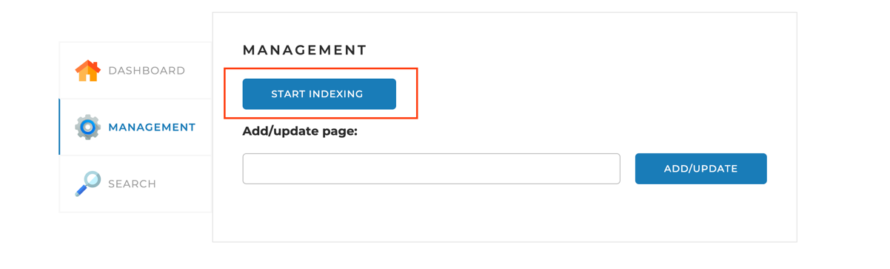
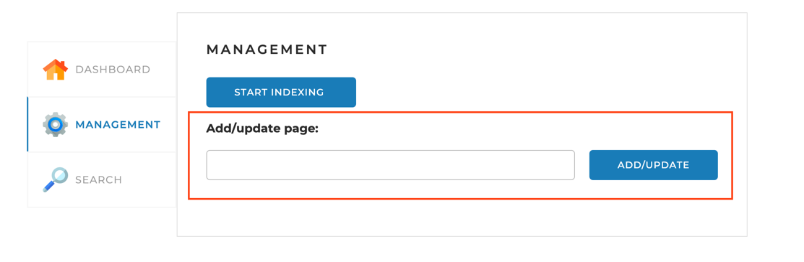

# Поисковый Движок по сайту

Этот проект представляет собой поисковый 
движок для информационно-новостного портала. 
Его цель - помогать посетителям сайта быстро находить информацию, используя поле поиска.

## Начало

Эти инструкции помогут вам начать работу с проектом и развернуть его на вашем компьютере.

### Предварительные требования

Прежде чем начать работу, убедитесь, что у вас есть следующее:

- Java 17
- Spring Boot
- MySQL

### Установка и настройка

1. Клонируйте репозиторий проекта: https://github.com/yuran9595/Final_project/tree/main/searchengine-master
2. Задайте адреса сайтов в конфигурационном файле перед запуском приложения.
3. Установите необходимые зависимости(Spring Boot проект).
4. Создайте базу данных MySQL и настройте подключение в `application.yaml`.

5. Запустите приложение.

### Использование

1. После запуска приложения, откройте веб-интерфейс в вашем браузере (обычно по адресу `http://localhost:8080`).
2. Начните индексацию сайта(ов).

3. Послед индексации, вы можете добавлять сайты вручную.

4. Для поиска информации, пройдите в Search, выберите сайт и задайте нужные слова в Query

## Разработка
По мере выполнения задач по реализации поискового движка, добавляйте описание и инструкции в данное README.

## Вклад

Если вы хотите внести свой вклад в разработку проекта, следуйте стандартному процессу отправки запросов на изменение (Pull Request).

